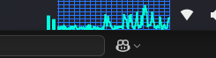

import yt_dlp  # Importa la biblioteca yt_dlp, que es una herramienta poderosa para descargar videos de YouTube
import socket  # Importa la biblioteca socket para manejar conexiones de red y timeouts

# Definición de la función principal que hará la descarga
def descargar_mp3(url):
    # Configuración para la descarga. Esto es un diccionario con varias opciones:
    config = {
        # Especifica que queremos el mejor audio disponible
        'format': 'bestaudio/best',
        
        # Configuración para el post-procesamiento (convertir a MP3)
        'postprocessors': [{
            'key': 'FFmpegExtractAudio',  # Usa FFmpeg para extraer el audio
            'preferredcodec': 'mp3',      # Formato de salida deseado
            'preferredquality': '192',    # Calidad del audio (192 kbps)
        }],
        
        # Plantilla para el nombre del archivo de salida
        # %(title)s será reemplazado por el título del video
        # %(ext)s será reemplazado por la extensión del archivo (.mp3)
        'outtmpl': '%(title)s.%(ext)s',
        
        'retries': 5,          # Número de reintentos si falla la descarga
        'socket_timeout': 15,  # Tiempo máximo de espera para la conexión (segundos)
    }

    # Bloque try-except para manejar posibles errores
    try:
        # Establece un timeout global de 15 segundos para operaciones de red
        socket.setdefaulttimeout(15)
        
        # Crea una instancia de YoutubeDL con nuestra configuración
        # El uso de 'with' asegura que los recursos se liberen correctamente
        with yt_dlp.YoutubeDL(config) as ydl:
            # Inicia la descarga del video usando la URL proporcionada
            ydl.download([url])
        
        # Mensaje de éxito si todo va bien
        print("✅ Descarga completada!")
    
    # Si ocurre cualquier error durante el proceso
    except Exception as e:
        # Muestra un mensaje de error con la descripción del problema
        print(f"❌ Error: {e}")

# Esta condición verifica si el script se está ejecutando directamente
# (no siendo importado como módulo)
if __name__ == "__main__":
    # URL del video de YouTube que queremos descargar
    url = "https://youtu.be/N4DAi9XArms?si=WdhmBdVFWTD1L5Jz"
    
    # Llama a nuestra función de descarga con la URL
    descargar_mp3(url)
# youtube_python
## clonado a CQ40(29/04/2025)

# Seguimos avanzando hacia el éxito!!!!
# Idea: Integrar en mp3_1.py la apikey de Gemini para que me transcriba los mp3, para luego que obtenga la idea principal de la canción o que nos diga de que se trata si toma el rol del artista en cuastión

# RESUMEN DE COMANDOS:
cd ~/Escritorio/youtube_python
source .venv/bin/activate
pip install yt-dlp
sudo apt install ffmpeg -y
python main.py
pip freeze > requirements.txt
git add requirements.txt
git commit -m "Agregar requirements.txt con librerías necesarias"
git push origin main
